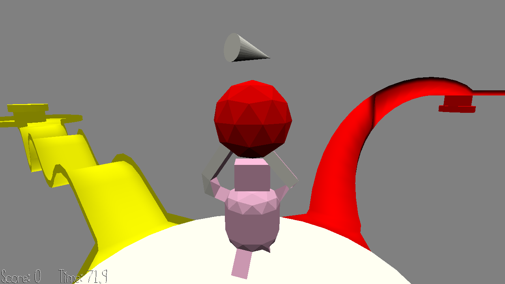

# Robot Delivery

Author: Jianxiang Li, Hao Wang

Design: Move around and do tasks using two keys to control moving left foot forward or right foot forward.

Screen Shot:

How To Play:

Move left and right feet in turn to move forward. If the order of left and right messed up, you might start moving backwards.
The goal is to deliver as many items to the correct destination as possible within limited time.

A: Move left foot. \
D: Move right foot. \
Space: Pick up or Drop the goods. Restart when game over.

Sources: 

Bit Bit Loop: https://freepd.com/music/Bit%20Bit%20Loop.mp3 \
Confirm Jingle: https://freesound.org/people/JustInvoke/sounds/446114/ \
PC Game UI Select: https://freesound.org/people/plasterbrain/sounds/464905/ \
Walk: https://freesound.org/people/FxKid2/sounds/362607/

This game was built with [NEST](NEST.md).

